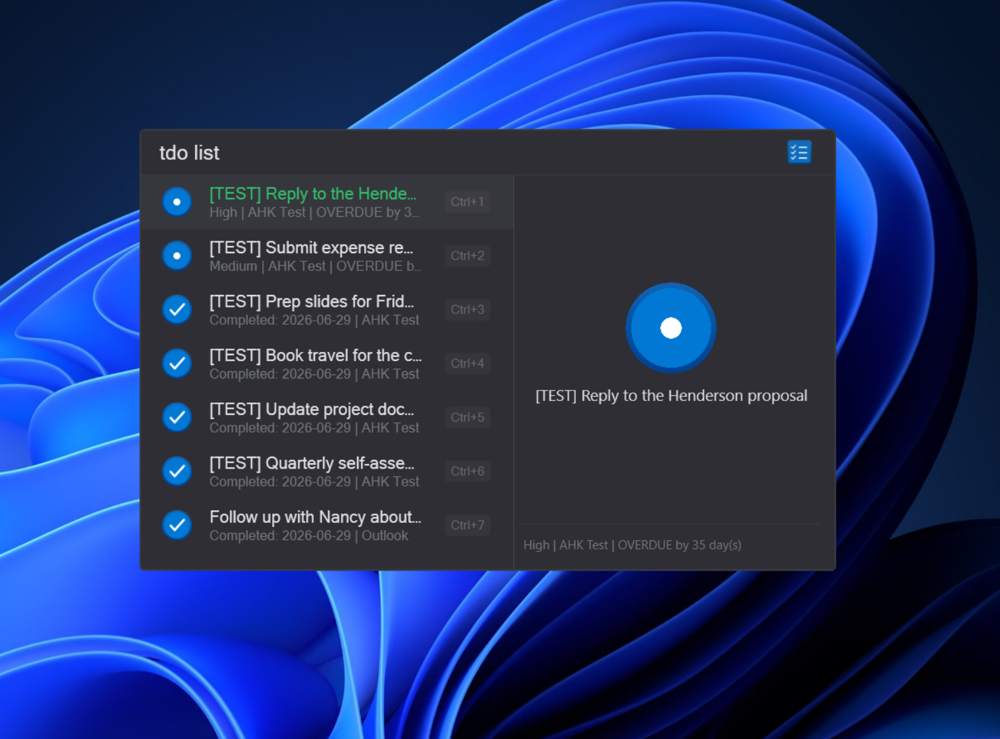
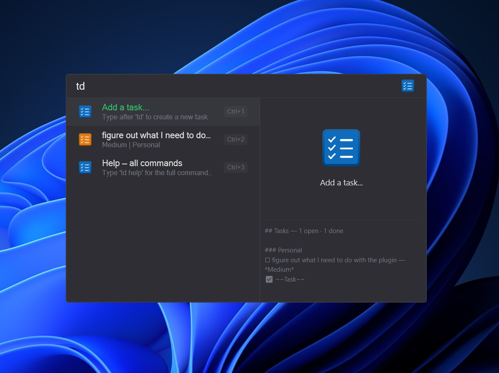

# QuickTodo for Flow Launcher

QuickTodo is a Flow Launcher plugin for creating and reviewing lightweight tasks with priorities, categories, due dates, reminders, optional Outlook Tasks support, and Outlook email search.





## Commands

- `td <task>` adds a local QuickTodo task.
- `td <task> !high @Work #tomorrow` adds a local task with priority, category, and due date.
- `td list` lists local tasks. Filter the list: `td list <text>`, `td list @Cat`, `td list !h`, `td list overdue`, `td list done`.
- `td edit` lists tasks to edit; pick one to prefill `td edit <id> <title>`, then change the title or any modifier and press Enter to save. Also available from a task's context menu ("Edit Task").
- `td help` (or `td ?`) shows every command as a navigable cheat sheet with a full Markdown reference in the preview pane.
- `td cat` lists local categories. `td cat add <name>` adds one; `td cat remove <name>` removes an unused one.
- `td outlook <task> !low @Work #tomorrow` creates a real Outlook task through desktop Outlook's COM object model.
- `td outlook list` lists incomplete Outlook tasks. Press Enter on a result to mark it complete.
- `td outlook diag` (or `tdo diag`) probes the Outlook COM connector step by step (bind, MAPI namespace, profile, default Tasks folder, task counts) and reports where it fails. Press Enter on the summary row to copy the full diagnostics JSON. Each bridge invocation is also logged to the Flow Launcher log.
- `tdo <task> !low @Work #tomorrow` is a shortcut for `td outlook <task>` — the `tdo` keyword goes straight to Outlook mode.
- `tdo list` lists incomplete Outlook tasks (same as `td outlook list`).
- `os <term>` searches your Outlook mail. Press Enter to run Outlook's own search across all folders; supports `from:` and `subject:` operators (e.g. `os from:sarah subject:invoice`).
- `os diag` runs the same step-by-step COM connector probe as `tdo diag`.

## Date and priority modifiers

- Priorities: `!low`, `!medium`, `!high` or `!l`, `!m`, `!h`.
- Dates: `#today`, `#tomorrow`, `#monday`, `#yyyy-MM-dd`, or `#MM-dd`.
- Times: append `@<time>` to a date, e.g. `#tomorrow@1430`, `#friday@9am`, `#today@17:00`. Accepts `HHmm`, `H:mm`, and `h[:mm]am/pm`. A timed task only counts as overdue once its time passes, and its reminder fires at that time.
- Recurrence: `#daily`, `#weekly`, `#monthly`, `#yearly`, or `#every-monday` … `#every-sunday`. For local tasks, completing a recurring task rolls its due date forward to the next occurrence instead of marking it done. For Outlook tasks (`td outlook` / `tdo`), recurrence is applied as a native Outlook `RecurrencePattern` so Outlook regenerates the task itself. Combine with a time, e.g. `#daily@9am` (times apply to local tasks only; Outlook tasks store the date).
- Categories: `@Work`, `@Personal`, `@Errands`, or custom local categories.

## Outlook support

The Outlook path uses desktop Outlook automation only:

- `Outlook.Application`
- `GetNamespace("MAPI")`
- `CreateItem(3)` for tasks
- `GetDefaultFolder(13)` for the default Tasks folder
- `Save()`, `Delete()`, and the task object model properties for mutations
- Outlook's own Instant Search (Explorer search box) for `os` mail queries

Outlook sync is handled by Outlook itself. If your default Tasks folder is backed by Exchange or Microsoft 365, saved tasks should sync to the mailbox and Microsoft To Do.

## Outlook email search

`os <term>` hands your query to Outlook's own Instant Search and brings the results to the front, so you get the same matches (and ranking) as typing in Outlook's search box.

- Searches across all mail folders by default.
- Supports Outlook search operators, e.g. `os from:sarah`, `os subject:invoice`, or `os from:sarah subject:invoice budget`.
- The search runs off the UI thread, so Flow Launcher never freezes while Outlook cold-starts. If Outlook is slow to open, the launcher closes and the search appears once Outlook is ready.
- `os diag` runs the same connector probe as `tdo diag` (see below).

## Troubleshooting Outlook (`tdo diag` / `os diag`)

If `tdo` or `os` misbehaves, run `tdo diag` (or `os diag`). It walks the COM bridge one step at a time and shows a ✓/✗ per step, so you can see exactly where it breaks. The summary row reports bind method, Outlook version, profile, Tasks folder, open/total task counts, inbox count, account/store counts, explorer availability, COM apartment state, PowerShell version, and process bitness. Press Enter on the summary to copy the full diagnostics JSON to the clipboard.

The probed steps, in order:

1. **Bind `Outlook.Application`** — attach to a running instance or start one.
2. **Read `Outlook.Version`** — confirm the COM object responds.
3. **Get MAPI namespace** — `GetNamespace("MAPI")`.
4. **Read current profile** — `Namespace.CurrentProfileName`.
5. **Get default Tasks folder (13)** — `GetDefaultFolder(13)`.
6. **Enumerate tasks** — total and incomplete counts.
7. **Get default Inbox folder (6)** — `GetDefaultFolder(6)` and item count (used by `os`).
8. **ActiveExplorer available** — needed to drive Instant Search for `os`.
9. **Enumerate accounts** — configured Outlook accounts.
10. **Enumerate stores** — mounted mail stores.

Every bridge invocation is also written to the Flow Launcher log, so you can review failures after the fact. The bridge runs through `Scripts\QuickTodo.OutlookTasks.ps1`; a missing or blocked script surfaces as a failed **Bind** step.

## Manual install

Download the release zip, then in Flow Launcher run:

```text
pm install <path-or-url-to-zip>
```

After install or update, restart Flow Launcher if the plugin was already loaded.
